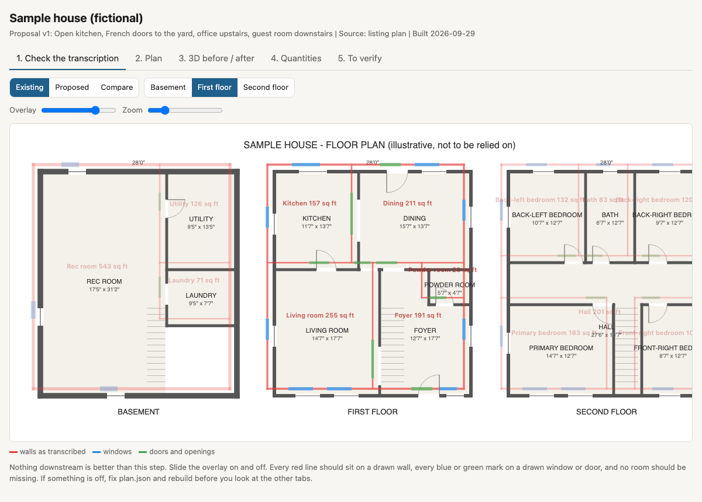
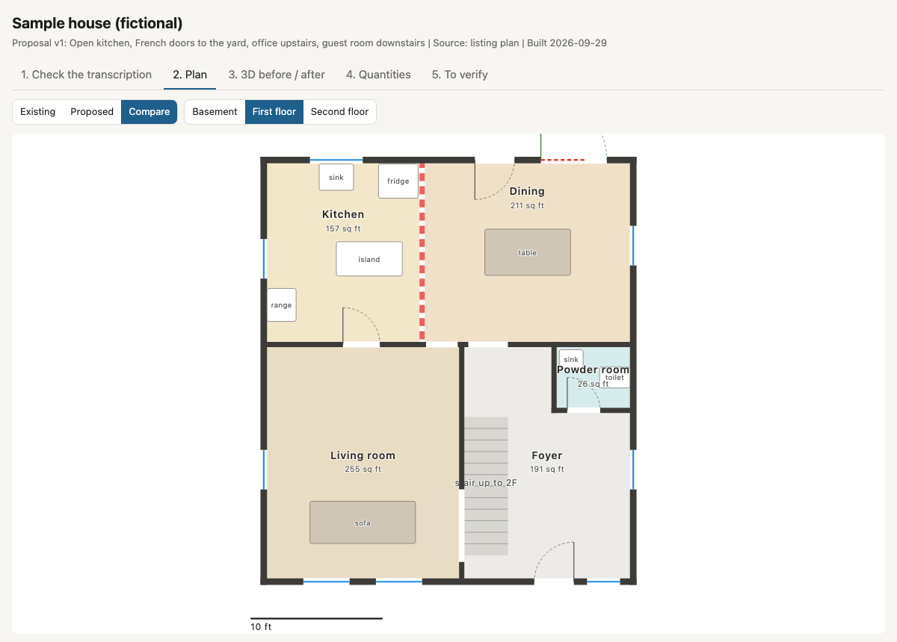
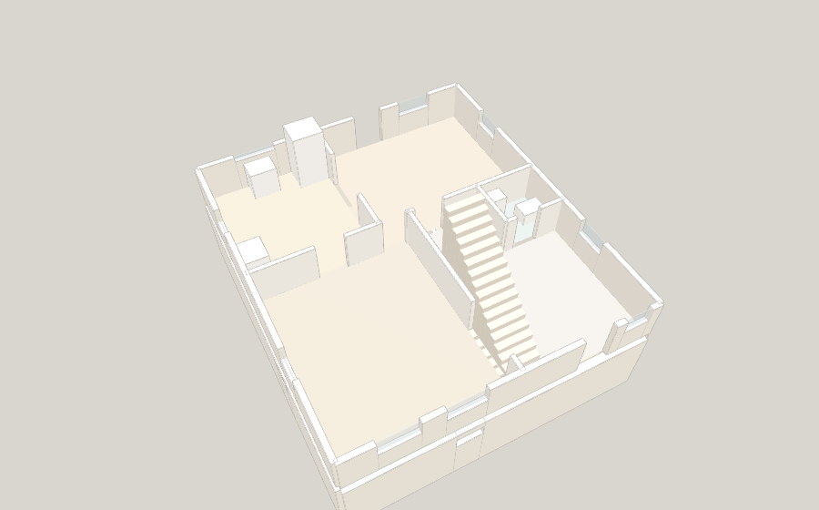
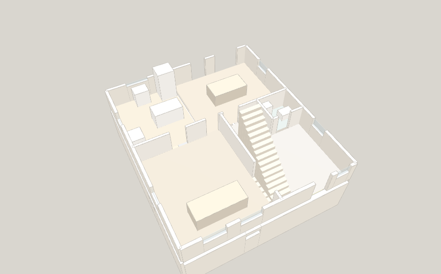

# HousingWizard

**Agent skills for people buying a home. Your AI works for your side of the deal, and it tells you what it cannot check.**

HousingWizard is a set of eleven [Agent Skills](https://github.com/agentskills/agentskills) that turn a general AI assistant into a careful helper for a home purchase: public-record due diligence, money limits, offers, inspection requests, contract review, closing, renovation planning, and a floor-plan tool that builds a 3D before-and-after with quantities you can send for quotes.

It works in Claude Code, Codex, Cursor, Gemini CLI and other agents that read `SKILL.md`, and can be uploaded to Claude and ChatGPT apps that support skills.

> Not legal, financial or inspection advice. The skills are built to send legal questions to your attorney, measurements to your tape measure, and judgment calls to licensed people.

## Why this exists

Buying a home means reading long documents under time pressure, in a process where the costly mistakes are the ones nobody points out. An AI assistant is good at some of that work and quietly bad at the rest.

Where an AI helps, for example:

- Noticing that the seller named in a contract is not the owner in the land records, which happens with estates, trusts and family transfers.
- Finding a rider clause that waives an inspection period, or a notice clause with the wrong email address for the buyer's attorney.
- Solving cash, monthly payment and reserve together, instead of one at a time, which can give two contradictory answers from the same numbers.
- Turning a long inspection report into a one-page request a seller can say yes to.

Where an AI fails, for example:

- Ranking houses from scraped listing data that is stale or wrong.
- Trusting a phone scan's ceiling height, which can be off by a factor of two, or its room detection, which can miss a room.
- Recalling a location, rate or code section from memory instead of checking a source.

So every skill here is built around the same idea: let the AI read, cross-check, calculate and draft, and make it end every answer with what a person still has to measure, confirm or decide.

## What is inside

| Skill | Use it when |
|---|---|
| `house-buying` | Start here. Finds your stage, reads your case file, says what is next and what only a person can do |
| `house-case-file` | Keep one true record per property so no session starts from zero and old numbers do not creep back |
| `house-records` | "Anything wrong with this house?" Violations, permits, ownership, estate signals, flood zone, listing forensics |
| `house-money` | "Can we afford it?" Cash to close, monthly payment, and the highest price that fits every limit at once |
| `house-offer` | "What should we offer?" Comparables, time on market, seller situation, a walk-away number, leak-checked messages |
| `house-visit` | Showings, second visits and the final walkthrough: what to look at and the measurements that decide legal use |
| `house-inspection` | Turn the report into a short, credible request: what to repair, what to credit, what to leave out |
| `house-contract` | Read the contract and riders: standard, risky, not worth raising; questions for your attorney; every deadline |
| `house-closing` | Commitment dates, rate lock, insurance, final walkthrough, wire fraud protection, first week after closing |
| `house-renovation` | Budget split by licensed work, materials and labor; permit order; quote packages; when and where to buy |
| `house-floorplan` | Floor plan image to checked plan, 3D before and after, quantities, and a list of what to verify |

Scripts are plain Python 3 with no packages to install.

## The floor plan tool

Give it a listing or agent floor plan. It transcribes the plan, lays the transcription over the original so you can check it, and builds one HTML file you can open anywhere.

| Check the transcription | Compare the proposal |
|---|---|
|  |  |

| Existing, same camera | Proposed, same camera |
|---|---|
|  |  |

It also produces floor, paint and baseboard quantities per room and a "to verify" list (unmeasured heights, areas the plan did not show, wall removals that need a structural check, a bedroom below grade that needs a legal-height check). Open `examples/sample-house/floorplan.html` to try it with a fictional house.

## Install

### Any agent, one command

```bash
npx skills add daniel1001a/HousingWizard
```

This uses the open [skills CLI](https://github.com/vercel-labs/skills), which installs to Claude Code, Codex, Cursor, Gemini CLI and many others. Add `-g` to install for your user instead of the current project, or `-a claude-code codex cursor` to pick agents.

### By hand

Copy the folders inside `skills/` to your agent's skills folder:

| Agent | User-level folder |
|---|---|
| Claude Code | `~/.claude/skills/` |
| Codex | `~/.agents/skills/` (current OpenAI docs; older Codex versions used `~/.codex/skills/`) |
| Cursor | `~/.cursor/skills/` or `~/.agents/skills/` (Cursor also reads `~/.claude/skills/`) |

```bash
git clone https://github.com/daniel1001a/HousingWizard.git
cp -R HousingWizard/skills/* ~/.claude/skills/
```

### Claude or ChatGPT apps (no terminal)

```bash
python3 tools/package_skills.py   # writes dist/<skill>.zip, one per skill
```

Or download the zips from the latest release. Then:

- **Claude apps:** Settings, turn on code execution, then upload each zip under Skills. Custom skill upload needs a paid plan.
- **ChatGPT:** Skills, Create, Upload from your computer, one zip per skill. As of September 2026 OpenAI lists skills for Business, Enterprise, Edu and Healthcare workspaces.
- **Any other chat app:** create a project, add `skills/house-buying/SKILL.md` and the skill files you need as project files, and start with "Use the house-buying instructions in the project files."

Scripts that call public-record APIs need network access. They run anywhere on your own computer; inside some chat sandboxes they may not.

### Which setup gets the best result

An agent that can read and write files on your computer (Claude Code, Codex, Cursor) keeps your case file between sessions, runs the scripts, and builds the floor-plan page. In a chat app you will paste the case file back each time. The advice is the same; the bookkeeping is on you.

## Quick start

Make an empty folder for your purchase, open your agent there, and try:

- "We're buying a house at [address]. Start a case file and tell us where we are."
- "Here's the listing link. Anything in the public records we should worry about?"
- "We have $220k cash, want to keep $30k, and can pay $5,500 a month. What's the most we should offer?"
- "Here's the inspection report. What should we ask the seller for?"
- "Our attorney sent the contract and rider. What should we worry about?"
- "Here's the floor plan. Show us what it looks like with the kitchen opened up, and how much flooring we need."

## How it works

**Stages.** Limits, shortlist, visit, offer, inspection, contract, mortgage to closing, after closing. `house-buying` places you on the map and routes to the right skill.

**A case file.** `homes/<address>/README.md` holds price, money, timeline, open items, decisions and a "what changed" log. When a new fact overturns an old conclusion, the conclusion is rewritten, not buried.

**Ten ground rules in every skill.** Tag every fact with its source (`[record]`, `[document]`, `[seen]`, `[seller said]`, `[estimate]`, `[assumption]`). Zero rows is not clean. Give the innocent explanation first. End with a human check. Legal points become questions for your attorney. Name the jurisdiction. Draft, never act. Stop at CAPTCHAs. Keep the case file true. Re-check anything time-sensitive.

## What the AI does and what you must do

| The AI can | You or a licensed person must |
|---|---|
| Read long reports and contracts and sort what matters | Measure ceiling heights, setbacks and anything that decides legal use |
| Cross-check public records against what the seller says | See, smell and hear the house; walk the commute |
| Model money with every limit at once | Get legal answers from your attorney |
| Draft calm, clear messages | Hire the inspector, sewer scope, oil tank sweep, surveyor, engineer |
| Make checklists for this house's age and systems | Decide price and walk-away |
| Keep deadlines and one true record | Send, sign and pay; verify wiring instructions by phone |

## Where it applies

| Coverage | Where | What it means |
|---|---|---|
| In depth | New York City, one- and two-family homes | Records script, legalization framework, contract notes, closing cost preset, checked against official sources in September 2026 |
| Generic US | Everywhere else in the US | Process, checklists, money model with your own tax inputs, FEMA flood-zone script for any address. Local rules are asked about, not asserted |
| Generic mode | Outside the US | Case file, document reading, checklists and money math. Local law is routed to your local professional |

Contributions for other states and cities are welcome; see [CONTRIBUTING.md](CONTRIBUTING.md). Every local rule needs a source and the date it was checked.

## Privacy

Your case file holds your finances and personal details. Keep it in a private folder; if you use git, use a private repository. The scripts only call public government APIs (NYC Open Data, NYC Geosearch, the US Census geocoder, FEMA) and send nothing else anywhere. The floor-plan page embeds your image and runs offline.

## Development

```bash
python3 -m unittest discover tests     # scripts, plan tools, skill format
python3 tools/check_skills.py          # frontmatter, English only, no em dashes, links resolve
python3 tools/sync_shared.py           # copy tools/shared_rules.md into every SKILL.md
python3 tools/package_skills.py        # zips for app upload
```

Behavior checks for each skill are in `evals/evals.json`.

## License

MIT for this repository. The bundled three.js files keep their own MIT license; see [THIRD_PARTY_NOTICES.md](THIRD_PARTY_NOTICES.md).

Built by [Ming](https://github.com/daniel1001a).
